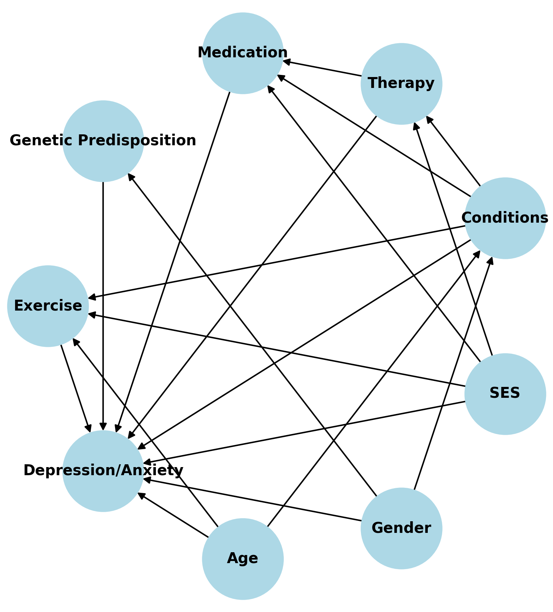

# The Impact of Exercise on Depression and Anxiety
Abby Brown

## Survey Link

https://surveys.sawtoothsoftware.com/67d8e5de3042f46d963b6cf2

## Description

### Fundamental Question:

Does regular exercise reduce symptoms of depression and anxiety in
individuals diagnosed with mental health conditions?

### Hypothesis:

Engaging in regular physical exercise leads to lower levels of
depression and anxiety.

### Introduction:

Mental health challenges are among the leading causes of workplace
absenteeism and reduced productivity globally, costing businesses
billions annually in lost output. Amid rising awareness of employee
well-being, companies are investing in wellness programs, including
fitness initiatives, with the expectation of improving employee mental
health and productivity.

This study aims to explore the causal relationship between regular
exercise and mental health outcomes, focusing on depression and anxiety.
The findings could provide actionable insights for businesses aiming to
design effective wellness programs, as well as inform policymakers about
the broader benefits of promoting physical activity.

### Variables and Data:

#### Primary variables:

These variables focus on quantifying mental health outcomes and exercise
behavior

- **Mental health outcomes**: depression/anxiety scores \| Depression
  and anxiety are primary indicators of mental health. Validated scales
  such as the PHQ-9 (Patient Health Questionnaire) and GAD-7
  (Generalized Anxiety Disorder Assessment) provide reliable, widely
  accepted metrics for assessing the severity of these conditions.
- **Exercise behavior**: Frequency, duration, and intensity of physical
  activity all offer unique insights in the relationship between
  exercise and mental health outcomes:
  - **Frequency**: Captures the consistency of exercise routines, which
    is hypothesized to influence mental health positively over time.
  - **Duration**: Measures the amount of time spent exercising per
    session, which alters the efficacy of physical activity.
  - **Intensity**: Differentiates between light, moderate, and vigorous
    exercise, as varying intensities may result in different
    psychological effects.

#### Covariates:

We will account for potential confounders that could influence both
mental health and exercise habits

- **Demographics**:
  - **Age**: Physical activity levels and mental health challenges often
    vary by age.
  - **Gender**: Exercise preferences and mental health prevalence can
    differ significantly between genders.
  - **Socioeconomic status (SES)**: SES can influence access to exercise
    resources (e.g., gym memberships, time) and mental health support.
- **Baseline health**:
  - **Pre-existing conditions**: Physical limitations or chronic
    illnesses may affect mental health or the ability to exercise.
  - **Baseline depression/anxiety scores**: Controlling for initial
    mental health levels ensures that observed changes are attributable
    to exercise.
- **Treatment factors**:
  - **Medication use**: Antidepressants or anxiolytics may interact with
    exercise effects on mental health.
  - **Therapy involvement**: Participation in therapy could amplify or
    obscure the effects of exercise.

#### Potential data sources:

- National databases (NHANES, BRFSS)
- Open datasets (OpenICPSR, Kaggle)
- Clinical datasets (MIMIC-IV)

### Methods to Explore:

1.  **Directed Acyclic Graphs (DAGs)**  
    Identify confounding variables and clarify the assumed causal
    structure

2.  **Propensity Score Matching**  
    Match individuals with similar baseline characteristics to isolate
    the effect of exercise

3.  **Difference-in-Differences (DiD)**  
    Compare mental health outcomes before and after individuals begin
    exercising

4.  **Regression Models**

    - **Linear regression** for continuous outcomes (e.g., depression
      scores)
    - **Logistic regression** for binary outcomes (e.g., presence or
      absence of clinical depression)

5.  **Bayesian Analysis**  
    Handle uncertainty in parameter estimates and incorporate
    hierarchical structures to assess varying effects across demographic
    groups

### Challenges:

#### Data Availability

- **Challenge**: Access to high-quality longitudinal datasets may be
  limited.  
- **Strategy**: Utilize widely available public health datasets and
  focus on data preprocessing and validation.

#### Confounding Variables

- **Challenge**: Not all confounders may be identified and/or adjusted
  for, and too many covariates may increase model complexity.  
- **Strategy**: Use DAGs to prioritize key confounders and sensitivity
  analyses to assess the impact of omitted variables.

#### Self-Reported Data

- **Challenge**: Exercise frequency and mental health outcome responses
  may be subject to recall errors or social desirability bias.  
- **Strategy**: Supplement self-reported data with objective measures
  (e.g., wearable device data) if available and quantify measurement
  error in models.

#### Data Imbalance

- **Challenge**: Unequal representation across demographic groups could
  bias results.
- **Strategy**: Apply weighting or oversampling techniques to address
  imbalance and perform subgroup analyses to explore heterogeneous
  effects.

#### Variability in Exercise Types

- **Challenge**: Different exercise types (e.g., aerobic vs. resistance
  training) might have distinct effects on mental health, complicating
  interpretation.  
- **Strategy**: Group exercise types into broad categories or focus on
  the most commonly reported type in the dataset.

### Directed Acyclic Graph (DAG)

The following DAG illustrates the hypothesized causal relationships in
the study:

#### Here are all paths connecting Exercise to Depression/Anxiety:

Exercise → Depression/Anxiety

Exercise ← Age → Depression/Anxiety

Exercise ← Age → Conditions ← Gender → Depression/Anxiety

Exercise ← Age → Conditions ← Gender → Genetic Predisposition →
Depression/Anxiety

Exercise ← Age → Conditions → Depression/Anxiety

Exercise ← Age → Conditions → Medication ← SES → Depression/Anxiety

Exercise ← Age → Conditions → Medication ← SES → Therapy →
Depression/Anxiety

Exercise ← Age → Conditions → Medication ← Therapy ← SES →
Depression/Anxiety

Exercise ← Age → Conditions → Medication ← Therapy → Depression/Anxiety

Exercise ← Age → Conditions → Medication → Depression/Anxiety

Exercise ← Age → Conditions → Therapy ← SES → Depression/Anxiety

Exercise ← Age → Conditions → Therapy ← SES → Medication →
Depression/Anxiety

Exercise ← Age → Conditions → Therapy → Depression/Anxiety

Exercise ← Age → Conditions → Therapy → Medication ← SES →
Depression/Anxiety

Exercise ← Age → Conditions → Therapy → Medication → Depression/Anxiety

Exercise ← SES → Depression/Anxiety

Exercise ← SES → Medication ← Conditions ← Age → Depression/Anxiety

Exercise ← SES → Medication ← Conditions ← Gender → Depression/Anxiety

Exercise ← SES → Medication ← Conditions ← Gender → Genetic
Predisposition → Depression/Anxiety

Exercise ← SES → Medication ← Conditions → Depression/Anxiety

Exercise ← SES → Medication ← Conditions → Therapy → Depression/Anxiety

Exercise ← SES → Medication ← Therapy ← Conditions ← Age →
Depression/Anxiety

Exercise ← SES → Medication ← Therapy ← Conditions ← Gender →
Depression/Anxiety

Exercise ← SES → Medication ← Therapy ← Conditions ← Gender → Genetic
Predisposition → Depression/Anxiety

Exercise ← SES → Medication ← Therapy ← Conditions → Depression/Anxiety

Exercise ← SES → Medication ← Therapy → Depression/Anxiety

Exercise ← SES → Medication → Depression/Anxiety

Exercise ← SES → Therapy ← Conditions ← Age → Depression/Anxiety

Exercise ← SES → Therapy ← Conditions ← Gender → Depression/Anxiety

Exercise ← SES → Therapy ← Conditions ← Gender → Genetic Predisposition
→ Depression/Anxiety

Exercise ← SES → Therapy ← Conditions → Depression/Anxiety

Exercise ← SES → Therapy ← Conditions → Medication → Depression/Anxiety

Exercise ← SES → Therapy → Depression/Anxiety

Exercise ← SES → Therapy → Medication ← Conditions ← Age →
Depression/Anxiety

Exercise ← SES → Therapy → Medication ← Conditions ← Gender →
Depression/Anxiety

Exercise ← SES → Therapy → Medication ← Conditions ← Gender → Genetic
Predisposition → Depression/Anxiety

Exercise ← SES → Therapy → Medication ← Conditions → Depression/Anxiety

Exercise ← SES → Therapy → Medication → Depression/Anxiety

Exercise ← Conditions ← Age → Depression/Anxiety

Exercise ← Conditions ← Gender → Depression/Anxiety

Exercise ← Conditions ← Gender → Genetic Predisposition →
Depression/Anxiety

Exercise ← Conditions → Depression/Anxiety

Exercise ← Conditions → Medication ← SES → Depression/Anxiety

Exercise ← Conditions → Medication ← SES → Therapy → Depression/Anxiety

Exercise ← Conditions → Medication ← Therapy ← SES → Depression/Anxiety

Exercise ← Conditions → Medication ← Therapy → Depression/Anxiety

Exercise ← Conditions → Medication → Depression/Anxiety

Exercise ← Conditions → Therapy ← SES → Depression/Anxiety

Exercise ← Conditions → Therapy ← SES → Medication → Depression/Anxiety

Exercise ← Conditions → Therapy → Depression/Anxiety

Exercise ← Conditions → Therapy → Medication ← SES → Depression/Anxiety

Exercise ← Conditions → Therapy → Medication → Depression/Anxiety

#### Based on these paths, we can determine the following:

- **Age**: ADJUST; affects exercise and depression/anxiety via multiple
  paths and appears as a common cause

- **Gender**: ADJUST; affects exercise and depression/anxiety via
  multiple paths and appears as a common cause via a pipe

- **SES**: ADJUST; common cause of both exercise and depression/anxiety

- **Pre-existing Conditions**: ADJUST; common cause of both exercise and
  depression/anxiety

- **Therapy**: DO NOT adjust; collider in paths like Conditions →
  Therapy ← SES; adjusting would open an unintended path

- **Medication**: DO NOT adjust; collider in paths like Conditions →
  Medication ← SES; adjusting would open an unintended path

- **Genetic Predisposition**: DO NOT adjust; collider in paths like
  Gender → Genetic Predisposition ← Depression/Anxiety; adjusting would
  open an unintended path

#### Final Adjustment Set: { Age, Gender, SES, Pre-existing Conditions }

## Project Organization

- `/code` Scripts with prefixes (e.g., `01_import-data.py`,
  `02_clean-data.py`) and functions in `/code/src`.
- `/data` Simulated and real data, the latter not pushed.
- `/figures` PNG images and plots.
- `/output` Output from model runs, not pushed.
- `/presentations` Presentation slides.
- `/private` A catch-all folder for miscellaneous files, not pushed.
- `/writing` Reports, posts, and case studies.
- `/.venv` Hidden project library, not pushed.
- `.gitignore` Hidden Git instructions file.
- `.python-version` Hidden Python version for the reproducible
  environment.
- `requirements.txt` Information on the reproducible environment.

## Reproducible Environment

After cloning this repository, go to the project’s terminal in Positron
and run `python -m venv .venv` to create the `/.venv` project library,
followed by `pip install -r requirements.txt` to install the specified
library versions.

Whenever you install new libraries or decide to update the versions of
libraries you use, run `pip freeze > requirements.txt` to update
`requirements.txt`.

For more details on using GitHub, Quarto, etc. see [ASC
Training](https://github.com/marcdotson/asc-training).
