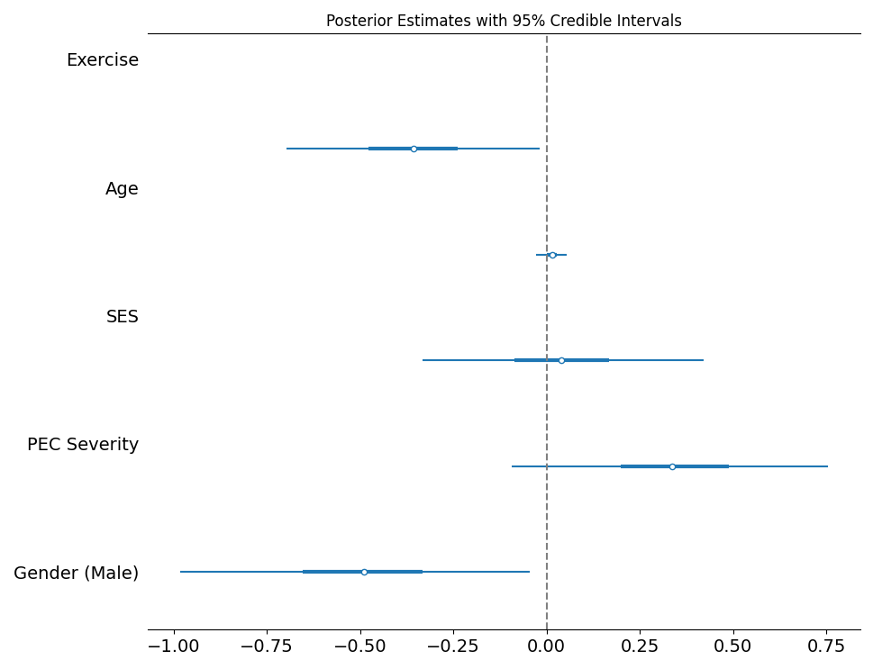

# Project Report


## Milestone 1: Project Idea

### Fundamental Question:

Does regular exercise reduce symptoms of depression and anxiety in
individuals diagnosed with mental health conditions?

### Hypothesis:

Engaging in regular physical exercise leads to lower levels of
depression and anxiety.

### Introduction:

Mental health challenges are among the leading causes of workplace
absenteeism and reduced productivity globally, costing businesses
billions annually in lost output. Amid rising awareness of employee
well-being, companies are investing in wellness programs, including
fitness initiatives, with the expectation of improving employee mental
health and productivity.

This study aims to explore the causal relationship between regular
exercise and mental health outcomes, focusing on depression and anxiety.
The findings could provide actionable insights for businesses aiming to
design effective wellness programs, as well as inform policymakers about
the broader benefits of promoting physical activity.

## Milestone 2: Data Story

### Variables and Data:

#### Primary variables:

These variables focus on quantifying mental health outcomes and exercise
behavior

- **Mental health outcomes**: depression/anxiety scores \| Depression
  and anxiety are primary indicators of mental health. Validated scales
  such as the PHQ-9 (Patient Health Questionnaire) and GAD-7
  (Generalized Anxiety Disorder Assessment) provide reliable, widely
  accepted metrics for assessing the severity of these conditions.
- **Exercise behavior**: Frequency, duration, and intensity of physical
  activity all offer unique insights in the relationship between
  exercise and mental health outcomes:
  - **Frequency**: Captures the consistency of exercise routines, which
    is hypothesized to influence mental health positively over time.
  - **Duration**: Measures the amount of time spent exercising per
    session, which alters the efficacy of physical activity.
  - **Intensity**: Differentiates between light, moderate, and vigorous
    exercise, as varying intensities may result in different
    psychological effects.

#### Covariates:

We will account for potential confounders that could influence both
mental health and exercise habits

- **Demographics**:
  - **Age**: Physical activity levels and mental health challenges often
    vary by age.
  - **Gender**: Exercise preferences and mental health prevalence can
    differ significantly between genders.
  - **Socioeconomic status (SES)**: SES can influence access to exercise
    resources (e.g., gym memberships, time) and mental health support.
- **Baseline health**:
  - **Pre-existing conditions**: Physical limitations or chronic
    illnesses may affect mental health or the ability to exercise.
  - **Baseline depression/anxiety scores**: Controlling for initial
    mental health levels ensures that observed changes are attributable
    to exercise.
- **Treatment factors**:
  - **Medication use**: Antidepressants or anxiolytics may interact with
    exercise effects on mental health.
  - **Therapy involvement**: Participation in therapy could amplify or
    obscure the effects of exercise.

#### Potential data sources:

- National databases (NHANES, BRFSS)
- Open datasets (OpenICPSR, Kaggle)
- Clinical datasets (MIMIC-IV)
- Survey data

### Methods to Explore:

1.  **Directed Acyclic Graphs (DAGs)**  
    Identify confounding variables and clarify the assumed causal
    structure

2.  **Propensity Score Matching**  
    Match individuals with similar baseline characteristics to isolate
    the effect of exercise

3.  **Difference-in-Differences (DiD)**  
    Compare mental health outcomes before and after individuals begin
    exercising

4.  **Regression Models**

    - **Linear regression** for continuous outcomes (e.g., depression
      scores)
    - **Logistic regression** for binary outcomes (e.g., presence or
      absence of clinical depression)

5.  **Bayesian Analysis**  
    Handle uncertainty in parameter estimates and incorporate
    hierarchical structures to assess varying effects across demographic
    groups

### Challenges:

#### Data Availability

- **Challenge**: Access to high-quality longitudinal datasets may be
  limited.  
- **Strategy**: Utilize widely available public health datasets and
  focus on data preprocessing and validation.

#### Confounding Variables

- **Challenge**: Not all confounders may be identified and/or adjusted
  for, and too many covariates may increase model complexity.  
- **Strategy**: Use DAGs to prioritize key confounders and sensitivity
  analyses to assess the impact of omitted variables.

#### Self-Reported Data

- **Challenge**: Exercise frequency and mental health outcome responses
  may be subject to recall errors or social desirability bias.  
- **Strategy**: Supplement self-reported data with objective measures
  (e.g., wearable device data) if available and quantify measurement
  error in models.

#### Data Imbalance

- **Challenge**: Unequal representation across demographic groups could
  bias results.
- **Strategy**: Apply weighting or oversampling techniques to address
  imbalance and perform subgroup analyses to explore heterogeneous
  effects.

#### Variability in Exercise Types

- **Challenge**: Different exercise types (e.g., aerobic vs. resistance
  training) might have distinct effects on mental health, complicating
  interpretation.  
- **Strategy**: Group exercise types into broad categories or focus on
  the most commonly reported type in the dataset.

## Milestone 3: Directed Acyclic Graph (DAG)

The following DAG illustrates the hypothesized causal relationships in
the study:


## Milestone 4: Identification Strategy

#### Here are all paths connecting Exercise to Depression/Anxiety:

Exercise → Depression/Anxiety

Exercise ← Age → Depression/Anxiety

Exercise ← Age → Conditions ← Gender → Depression/Anxiety

Exercise ← Age → Conditions ← Gender → Genetic Predisposition →
Depression/Anxiety

Exercise ← Age → Conditions → Depression/Anxiety

Exercise ← Age → Conditions → Medication ← SES → Depression/Anxiety

Exercise ← Age → Conditions → Medication ← SES → Therapy →
Depression/Anxiety

Exercise ← Age → Conditions → Medication ← Therapy ← SES →
Depression/Anxiety

Exercise ← Age → Conditions → Medication ← Therapy → Depression/Anxiety

Exercise ← Age → Conditions → Medication → Depression/Anxiety

Exercise ← Age → Conditions → Therapy ← SES → Depression/Anxiety

Exercise ← Age → Conditions → Therapy ← SES → Medication →
Depression/Anxiety

Exercise ← Age → Conditions → Therapy → Depression/Anxiety

Exercise ← Age → Conditions → Therapy → Medication ← SES →
Depression/Anxiety

Exercise ← Age → Conditions → Therapy → Medication → Depression/Anxiety

Exercise ← SES → Depression/Anxiety

Exercise ← SES → Medication ← Conditions ← Age → Depression/Anxiety

Exercise ← SES → Medication ← Conditions ← Gender → Depression/Anxiety

Exercise ← SES → Medication ← Conditions ← Gender → Genetic
Predisposition → Depression/Anxiety

Exercise ← SES → Medication ← Conditions → Depression/Anxiety

Exercise ← SES → Medication ← Conditions → Therapy → Depression/Anxiety

Exercise ← SES → Medication ← Therapy ← Conditions ← Age →
Depression/Anxiety

Exercise ← SES → Medication ← Therapy ← Conditions ← Gender →
Depression/Anxiety

Exercise ← SES → Medication ← Therapy ← Conditions ← Gender → Genetic
Predisposition → Depression/Anxiety

Exercise ← SES → Medication ← Therapy ← Conditions → Depression/Anxiety

Exercise ← SES → Medication ← Therapy → Depression/Anxiety

Exercise ← SES → Medication → Depression/Anxiety

Exercise ← SES → Therapy ← Conditions ← Age → Depression/Anxiety

Exercise ← SES → Therapy ← Conditions ← Gender → Depression/Anxiety

Exercise ← SES → Therapy ← Conditions ← Gender → Genetic Predisposition
→ Depression/Anxiety

Exercise ← SES → Therapy ← Conditions → Depression/Anxiety

Exercise ← SES → Therapy ← Conditions → Medication → Depression/Anxiety

Exercise ← SES → Therapy → Depression/Anxiety

Exercise ← SES → Therapy → Medication ← Conditions ← Age →
Depression/Anxiety

Exercise ← SES → Therapy → Medication ← Conditions ← Gender →
Depression/Anxiety

Exercise ← SES → Therapy → Medication ← Conditions ← Gender → Genetic
Predisposition → Depression/Anxiety

Exercise ← SES → Therapy → Medication ← Conditions → Depression/Anxiety

Exercise ← SES → Therapy → Medication → Depression/Anxiety

Exercise ← Conditions ← Age → Depression/Anxiety

Exercise ← Conditions ← Gender → Depression/Anxiety

Exercise ← Conditions ← Gender → Genetic Predisposition →
Depression/Anxiety

Exercise ← Conditions → Depression/Anxiety

Exercise ← Conditions → Medication ← SES → Depression/Anxiety

Exercise ← Conditions → Medication ← SES → Therapy → Depression/Anxiety

Exercise ← Conditions → Medication ← Therapy ← SES → Depression/Anxiety

Exercise ← Conditions → Medication ← Therapy → Depression/Anxiety

Exercise ← Conditions → Medication → Depression/Anxiety

Exercise ← Conditions → Therapy ← SES → Depression/Anxiety

Exercise ← Conditions → Therapy ← SES → Medication → Depression/Anxiety

Exercise ← Conditions → Therapy → Depression/Anxiety

Exercise ← Conditions → Therapy → Medication ← SES → Depression/Anxiety

Exercise ← Conditions → Therapy → Medication → Depression/Anxiety

#### Based on these paths, we can determine the following:

- **Age**: ADJUST; affects exercise and depression/anxiety via multiple
  paths and appears as a common cause

- **Gender**: ADJUST; affects exercise and depression/anxiety via
  multiple paths and appears as a common cause via a pipe

- **SES**: ADJUST; common cause of both exercise and depression/anxiety

- **Pre-existing Conditions**: ADJUST; common cause of both exercise and
  depression/anxiety

- **Therapy**: DO NOT adjust; collider in paths like Conditions →
  Therapy ← SES; adjusting would open an unintended path

- **Medication**: DO NOT adjust; collider in paths like Conditions →
  Medication ← SES; adjusting would open an unintended path

- **Genetic Predisposition**: DO NOT adjust; collider in paths like
  Gender → Genetic Predisposition ← Depression/Anxiety; adjusting would
  open an unintended path

#### Final Adjustment Set: { Age, Gender, SES, Pre-existing Conditions }

## Milestone 5: Simulate Data and Recover Parameters

``` python
import numpy as np
import polars as pl
import seaborn.objects as so
from sklearn.linear_model import LinearRegression

np.random.seed(42)

# Set the parameter values.

intercept = 3
slope_exercise = -2
slope_age = 1.2
slope_gender = 2
slope_conditions = [0.4,0.6,0.8,1]
slope_SES = [-0.5,-1.7,-2.4,-3.3]
n = 100000

sim_data = (
# Simulate predictors using appropriate np.random distributions.
    pl.DataFrame({
        'exercise': np.random.uniform(0, 240, size = n),
        'age': np.random.normal(35,10,size=n),
        'gender':np.random.choice([0,1], size=n).astype(int),
        'conditions':np.random.choice([1,2,3,4,5], size=n).astype(int),
        'SES':np.random.choice([1,2,3,4,5],size=n).astype(int)
})
)

# One-hot encode conditions and SES
sim_data = sim_data.with_columns([
    (pl.col("conditions") == i).cast(pl.Int8).alias(f"conditions_{i}") for i in range(2, 6)
] + [
    (pl.col("SES") == i).cast(pl.Int8).alias(f"SES_{i}") for i in range(2, 6)
])

# Use predictors and parameter values to simulate the outome.
sim_data = sim_data.with_columns([
(intercept + 
slope_exercise * pl.col('exercise') + 
slope_age * pl.col('age') + 
slope_gender * (pl.col('gender') == 1) + 
slope_conditions[0] * (pl.col("conditions") == 2).cast(pl.Int8).alias("conditions_2") +
slope_conditions[1] * (pl.col("conditions") == 3).cast(pl.Int8).alias("conditions_3") +
slope_conditions[2] * (pl.col("conditions") == 4).cast(pl.Int8).alias("conditions_4") +
slope_conditions[3] * (pl.col("conditions") == 5).cast(pl.Int8).alias("conditions_5") +
slope_SES[0] * (pl.col("SES") == 2).cast(pl.Int8).alias("SES_2") +
slope_SES[1] * (pl.col("SES") == 3).cast(pl.Int8).alias("SES_3") +
slope_SES[2] * (pl.col("SES") == 4).cast(pl.Int8).alias("SES_4") +
slope_SES[3] * (pl.col("SES") == 5).cast(pl.Int8).alias("SES_5") +
np.random.normal(0, 3, size = n)).alias('y')
])


sim_data

# Specify the X matrix and y vector.
X = sim_data[['exercise','age','gender','conditions_2','conditions_3','conditions_4','conditions_5','SES_2','SES_3','SES_4','SES_5']]
y = sim_data['y']

# Create a linear regression model.
model = LinearRegression(fit_intercept=True)

# Train the model.
model.fit(X, y)

# Print the coefficients
print(f'Intercept: {model.intercept_}')
print(f'Exercise Slope: {model.coef_[0]}')
print(f'Age Slope: {model.coef_[1]}')
print(f'Gender Slope: {model.coef_[2]}')
for i in range(4):
    print(f'Conditions_{i+2} Slope: {model.coef_[3+i]}')
for i in range(4):
    print(f'SES_{i+2} Slope: {model.coef_[7+i]}')
```

    Intercept: 3.028644105261094
    Exercise Slope: -2.000034387857988
    Age Slope: 1.1996545015659217
    Gender Slope: 1.9637143626979336
    Conditions_2 Slope: 0.3963918913333407
    Conditions_3 Slope: 0.6039452220457617
    Conditions_4 Slope: 0.7923920912687532
    Conditions_5 Slope: 0.9848525039773084
    SES_2 Slope: -0.502186980204505
    SES_3 Slope: -1.6910905070654232
    SES_4 Slope: -2.367886593640162
    SES_5 Slope: -3.2644099535504503

Using this structure, I was able to recover the simulated parameters.

## Milestone 6: Exploratory Data Analysis

### Data Source

This analysis is based on self-reported survey data collected from a
convenience sample of 49 participants.

Variables:

- *exercise_score*: Composite score representing exercise habits (based
  on duration, intensity, frequency, and regularity of exercise)

- *age*: Age of the respondent in years

- *ses*: Socioeconomic status, an ordinal variable (1–3; Low, Medium,
  High) combining income category (low vs high) and gym/rec center
  access

- *pec_severity*: Severity of pre-existing physical conditions, scored
  from 0 to 2:

  - 0 = No pre-existing conditions

  - 1 = Conditions that moderately affect exercise

  - 2 = Conditions that severely impact exercise ability

- *gender*: Gender of the respondent, encoded as Female = 0, Male = 1

- *mh_score*: Composite mental health score combining official
  diagnosis, unofficial diagnosis, and symptom frequency.

### Variable Distributions

Below are the univariate distributions for all key variables. These help
assess scale, skewness, and potential outliers.


- Age is centered at about 22 years old, with 2 outliers in their late
  40s, which means the causal model will be most generalizable to young
  adults.

- Pre-existing condition severity skews toward zero, with most
  participants reporting no long-term physical conditions. This may
  limit its informativeness in the model.

- Gender is imbalanced, with twice as many female respondents as male.

- SES is relatively balanced between low and medium levels with few
  respondents in the high category.

- Exercise score is relatively left-skewed, indicating more variability
  among below-average exercisers, while those with higher scores tend to
  follow similar routines.

- Mental health score is slightly right-skewed, suggesting slightly
  greater variability among participants with higher levels of mental
  health challenges.

### Correlation Matrix

The correlation matrix highlights pairwise linear relationships between
numeric variables. Notably, exercise_score shows a modest negative
correlation with mh_score, suggesting a potential inverse relationship
(i.e., more exercise may be associated with better mental health
outcomes)


### Exercise vs Mental Health

A glance at various scatterplots between exercise_score and mh_score
imply an inverse relationship between the two variables, consistent with
the correlation matrix. This trend persists across stratifications,
indicating that the association is not driven by any one subgroup.

#### By Gender


#### By Pre-existing Conditions)


#### By SES)


## Milestone 7: Estimate Causal Effects

I used Bayesian linear regression to estimate the direct causal effect
of exercise on mental health, controlling for age, socioeconomic status
(SES), pre-existing condition (PEC) severity, and gender.

``` python
import pymc as pm
import arviz as az
import pandas as pd
import matplotlib.pyplot as plt

# Load and prepare data
df = pd.read_excel('./data/Project/healthdata.xlsx')

# Feature matrix
X = df[["exercise_score", "age", "ses", "pec_severity"]].copy()
X["gender"] = df["gender"].map({"Female": 0, "Male": 1})

y = df["mh_score"].values
X_np = X.values

############################################################
# Specify model
############################################################
ex_model = pm.Model()

with ex_model:
    # Data
    X_data = pm.Data("X_data", X_np)
    y_data = pm.Data("y_data", y)

    # Priors
    alpha = pm.Normal("alpha", mu=0, sigma=1) # mental health score when all predictors = 0 is around 0, give/take 1
    beta = pm.Normal("beta", mu=0, sigma=1, shape=X_np.shape[1]) # exercise/age/etc could affect MH score, centered at 0, likely small
    sigma = pm.HalfNormal("sigma", sigma=1) # says standard deviation is positive, loosely assumes noise around 1

    # Likelihood
    mu = alpha + pm.math.dot(X_data, beta)
    y_obs = pm.Normal("y_obs", mu=mu, sigma=sigma, observed=y_data

with ex_model:
    # Sample from posterior
    draws = pm.sample(target_accept=0.95, random_seed=42)

############################################################
# Visualize and interpret
############################################################

# Summarize posterior
summary_df = az.summary(draws, var_names=["beta"], hdi_prob=0.95)
summary_df

# Visualize marginal posteriors
az.plot_forest(draws, var_names=["beta"], combined=True, hdi_prob=0.95, 
               figsize=(8, 5), 
               ridgeplot_overlap=0)
plt.axvline(0, color='gray', linestyle='--')
plt.title("Posterior Estimates with 95% Credible Intervals")
plt.yticks([0,1,2,3,4], ["Gender (Male)", "PEC Severity", "SES", "Age", "Exercise"])
plt.tight_layout()
plt.show()
```

| Coefficient | Variable       | Mean   | 2.5% HDI | 97.5% HDI |
|-------------|----------------|--------|----------|-----------|
| beta\[0\]   | exercise_score | -0.357 | -0.698   | -0.019    |
| beta\[1\]   | age            | 0.015  | -0.029   | 0.054     |
| beta\[2\]   | ses            | 0.038  | -0.333   | 0.421     |
| beta\[3\]   | pec_severity   | 0.341  | -0.092   | 0.755     |
| beta\[4\]   | gender (Male)  | -0.494 | -0.982   | -0.044    |



According to this specified model, the causal effect of exercise_score
on mh_score is -0.357 with 95% bounds both less than 0, which means that
exercise has a significant negative impact on poor mental health
outcomes, or, in other words, exercise has a positive effect on overall
mental health.

``` python
############################################################
# Prior/Posterior Predictive Checks
############################################################

# Prior predictive check
with ex_model:
    prior = pm.sample_prior_predictive()
plt.figure(figsize=(10, 6))
az.plot_dist(prior.prior_predictive["y_obs"], label="Prior Predictive")
az.plot_dist(y, color='C1', label="Observed")
plt.title("Prior Predictive Check")
plt.legend()
plt.show()
```


``` python
# Posterior predictive check
with ex_model:
    posterior = pm.sample_posterior_predictive(draws)
plt.figure(figsize=(10, 6))
az.plot_dist(posterior.posterior_predictive["y_obs"], label="Posterior Predictive")
az.plot_dist(y, color='C1', label="Observed")
plt.title("Posterior Predictive Check")
plt.legend()
plt.show()
```


These images show that the prior is weakly informative (by design) and
that the derived posterior distribution strongly matches what we
observed in the data.

## Milestone 8: Intermediate Presentation

See my intermediate presentation
[slides](https://github.com/babigail100/causal_inference/blob/main/presentations/intermediate.html).
A few highlights from the feedback and considerations moving forward:

- **Convenience sampling:** While not ideal for large scopes, the
  constraints of this project (limited time and resources) made a
  smaller, convenience sample the most practical choice. It still
  allowed me to include the features necessary for my causal model.

- **Survey design:** I plan to include a broad and thoughtful range of
  survey questions to maximize the relevance and completeness of the
  data feeding into the model.

## Milestone 9: Conjoint Experiment

To better understand individual preferences around exercise routines, I
conducted a conjoint analysis experiment in which participants were
asked to choose between various hypothetical exercise programs. Each
program varied across features commonly considered in real-world
decision-making.

### Design

Participants responded to 15 choice-based conjoint (CBC) tasks, each
consisting of 7 alternative exercise programs plus a “None” option. Each
program was defined by the following attributes and levels:

- **Type**: Running, Walking, Hiking, Biking, Swimming, Pilates, Yoga,
  Weight-lifting, Aerobics, Calisthenics, Sport

- **Intensity**: Light, Moderate, Vigorous

- **Duration**: 15, 30, 45, 60, 90, or 120 minutes

- **Frequency**: Once to seven times per week

- **Setting**: Indoor or Outdoor

### Example Task


### Results

#### Attribute Importance

Participants cared much more about what kind of exercise they were doing
than where they did it or how intense it was.

- Type (43.09%) — by far the most important factor

- Duration (22.22%)

- Frequency (21.32%)

- Intensity (8.03%)

- Setting (5.34%) — least influential

#### Utilities

Type:

- Most preferred: Weightlifting (57.53), Walking (55.98), Sport (27.43),
  Yoga (17.00)

- Least preferred: Aerobics (-52.48), Pilates (-36.48), Swimming
  (-24.40), Biking (-23.94)

Intensity: Likely a preference for accessibility or sustainability

- Most preferred: Light (7.02)

- Least preferred: Vigorous (-10.54)

Duration:

- Most preferred: 30 minutes (27.63), followed by 45 min (11.67) and 15
  min (10.91)

- Least preferred: 120 minutes (-50.87), 90 minutes (-2.38)

Frequency: most people liked moderate commitment

- Most preferred: 3x/week (31.94) and 2x/week (14.89)

- Least preferred: 7x/week (-31.52) and 6x/week (-25.36)

Setting:

- Slight preference for Outdoor (8.96) over Indoor (-8.96)

“None” Option: most people chose at least one of the offered routines,
which confirms the design was reasonable and engaging.

- Utility of -0.52 with a large standard error (14.57)

### Interpretation

This experiment helps identify the types of exercise routines
individuals are most likely to adopt. These preferences could inform
health promotion strategies by emphasizing common, accessible types of
exercise that align with public preference (e.g., walking/weightlifting,
moderate intensity, 15-45 min durations). In the broader context of this
project, these insights complement the causal analysis by determining
which exercise formats are most likely to be feasible interventions.

## Milestone 10: Difference-in-Differences (DiD)

### Consideration:

Difference-in-Differences is used when you have a clear before/after
intervention and a treatment/control group, allowing you to estimate the
causal effect of a treatment by comparing changes over time between
groups.

### Justification of Applicability:

DiD would not be applicable to this particular project. My data is
collected at a single time point rather than before and after a
treatment. There’s no natural “intervention” or event that splits the
data into pre/post periods, so the assumptions of DiD (parallel trends,
temporal ordering) don’t hold.

If, hypothetically, I had longitudinal data where some individuals
started an exercise regimen at time t, and others didn’t, then this
method would be useful. Instead, I explored DiD using simulated data:

``` python
import numpy as np
import pandas as pd
import pymc as pm
import arviz as az

def is_treated(t, intervention_time, group):
    return (t > intervention_time) * group

def outcome(t, control_int, treat_int_delta, trend, delta, group, treated):
    return control_int + (treat_int_delta * group) + (t * trend) + (delta * treated * group)

# Define parameters
control_int = 1
treat_int_delta = 0.25
trend = 1
delta = 0.5
intervention_time = 0.5

# Create panel
df = pd.DataFrame({
    "group": [0,0,1,1]*10,
    "t": [0.0,1.0,0.0,1.0]*10,
    "unit": np.concatenate([[i]*2 for i in range(20)])
})
df["treated"] = is_treated(df["t"], intervention_time, df["group"])
df["y"] = outcome(df["t"], control_int, treat_int_delta, trend, delta, df["group"], df["treated"]) + np.random.normal(0, 0.1, df.shape[0])

# Frequentist DiD estimate
diff_control = df.query("t == 1 and group == 0")["y"].mean() - df.query("t == 0 and group == 0")["y"].mean()
diff_treat = df.query("t == 1 and group == 1")["y"].mean() - df.query("t == 0 and group == 1")["y"].mean()
diff_in_diff = diff_treat - diff_control
print(f"Diff-in-Diff estimate: {diff_in_diff:.2f}")
```

    Diff-in-Diff estimate: 0.48

## Milestone 12: Consider Matching Strategy

### Consideration:

Matching helps reduce confounding by creating more balanced groups based
on covariates, approximating a randomized experiment.

### Justification of Applicability:

Given the observational nature of my dataset, matching could
theoretically improve balance between people with different propensities
to exercise. However, exercise as a treatment is not necessarily binary
(like “exerciser” vs “non-exerciser”) and cannot be feasibly randomized
in the scope of my project, and the small size of my dataset would be
problematic.

## Milestone 13: Consider Regression Discontinuity Design (RDD)

### Consideration:

RDD is used when treatment assignment is based on a cutoff in a
continuous variable (e.g., income \> \$50k = eligible for program). It
estimates causal effects at the threshold.

### Justification of Applicability:

RDD is not applicable to my project, as there is no clear
threshold-based treatment. Exercise and mental health scores are both
continuous, and there’s no external rule or policy assigning treatment
based on a cutoff (e.g., “people with score \> X get treatment”).
However, in the same context, age 18 could be considered an exercise
threshold because academic requirements to attend physical education
classes are lifted, but this threshold leads to superfluous confounders
relating to high school graduation.

## Milestone 14: Final Presentation

See my final presentation
[slides](https://github.com/babigail100/causal_inference/blob/main/presentations/final_presentation.html).
To summarize some feedback:

- **Sample size and representation:** A more extensive or representative
  survey sample would likely lead to more generalizable conclusions,
  though the results aligned with my hypothesis that exercise has a
  positive impact on mental health outcomes.

- **Unmeasured confounding:** There are likely additional confounding
  variables that weren’t included in the DAG or model. Given more time
  and resources, expanding the model to account for these omitted
  variables would improve the reliability and depth of the analysis.
